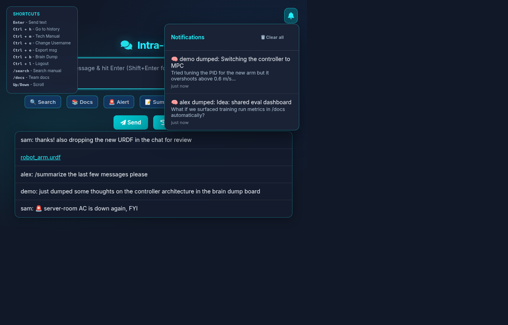
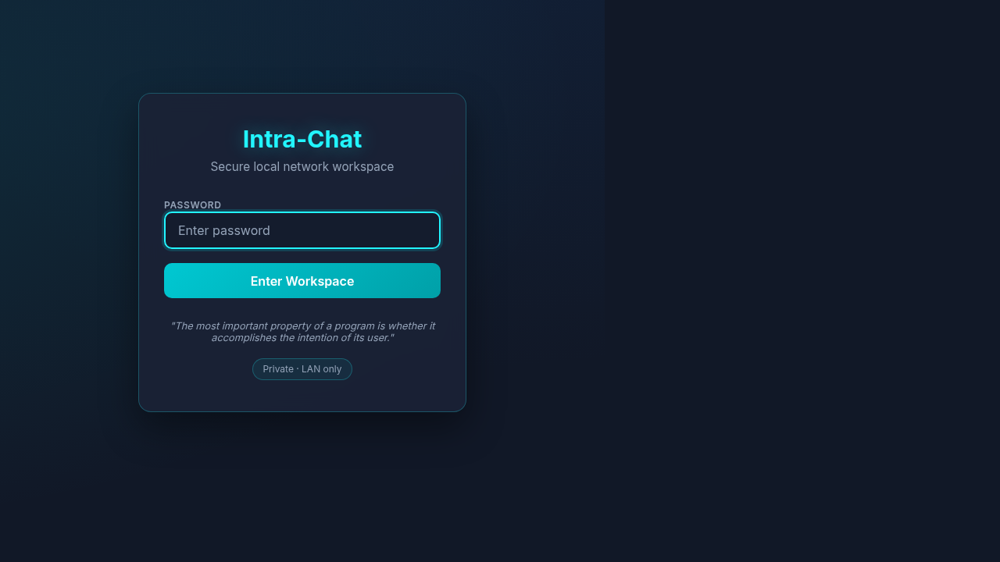
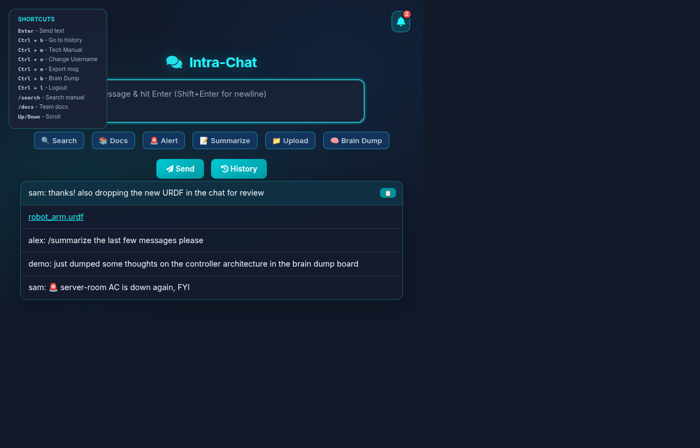
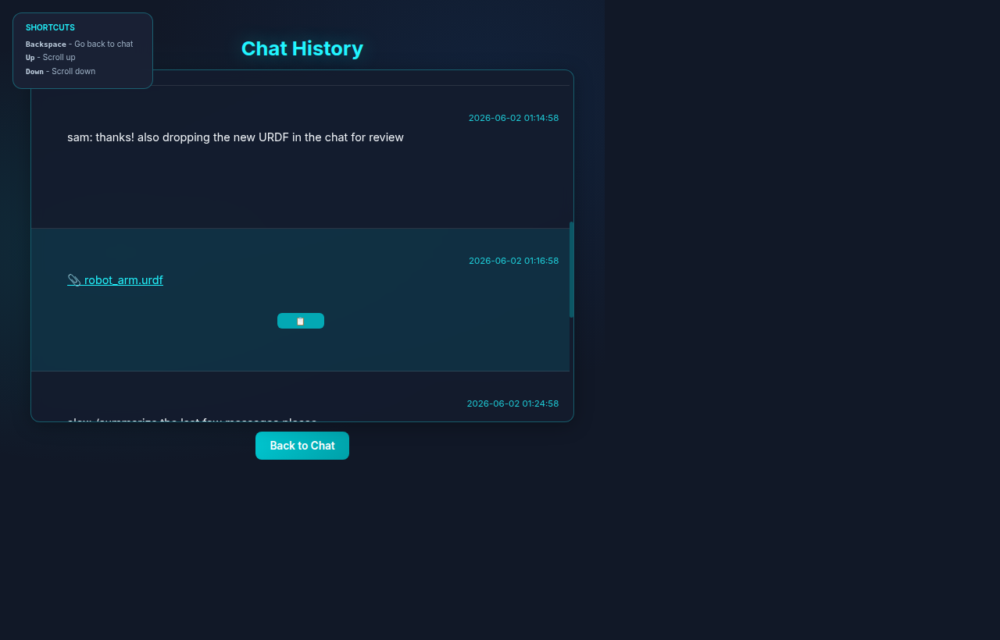
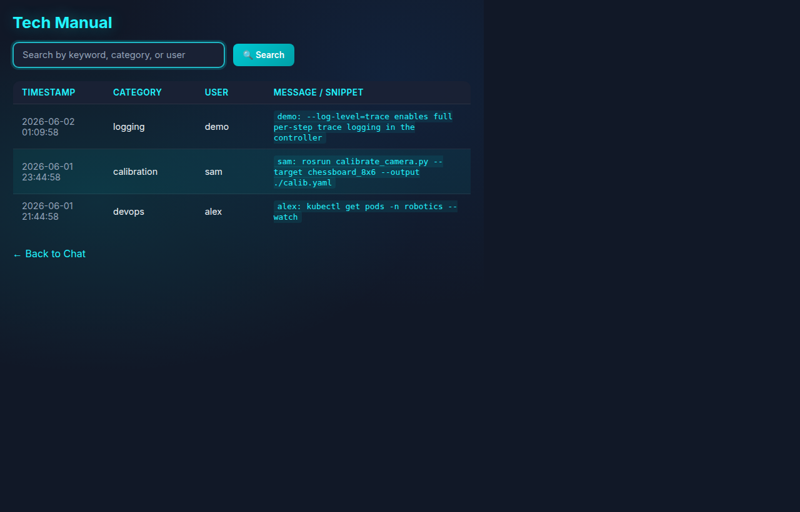
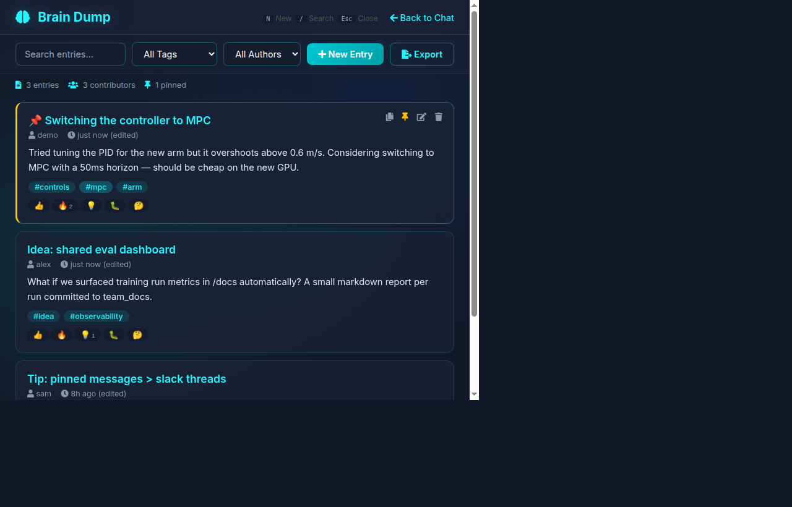

<div align="center">

# 💬 Intra-Chat

**A self-hosted, real-time chat for your team's local network — with file
sharing, a searchable command manual, a shared brain-dump board, and an
optional local-LLM summariser.**

[](LICENSE)
[](https://www.python.org/downloads/)
[](https://flask.palletsprojects.com/)
[](https://socket.io/)
[](#)

<sub>No accounts. No cloud. No tracking. One Python process and a browser.</sub>

<br/>



</div>

---

## Why Intra-Chat?

Most team-chat tools assume the cloud. Intra-Chat assumes the opposite:
**a single Python process on your LAN**, accessed by everyone over a browser.
No SaaS subscriptions, no third-party servers, no data leaving your network.

It started as an internal tool for a robotics team that wanted a place to:

- 🚀 Drop **commands and snippets** into a shared scrollback that doesn't
  vanish when Slack forgets it.
- 📚 Pin the good stuff into a **searchable tech manual** with one keystroke.
- 🧠 Capture half-baked ideas in a **brain-dump board** with reactions and
  tags — independent from the chat noise.
- 🔔 Stay aware via **real-time notifications** (with sound + browser push)
  when teammates publish something worth seeing.
- 🤖 Get **AI summaries** of long conversations using a model running on
  your own machine (Ollama).

It is intentionally small. One file (`app.py`), one HTML template per
feature, JSON files for storage. The whole thing fits in your head.

## Features

|   | Feature | What it does |
|---|---------|--------------|
| 💬 | **Real-time chat** | Socket.IO-powered, persistent across reloads, message history with sane retention. |
| 📁 | **Smart file uploads** | Drag-and-drop with auto-categorisation across 14 buckets (code, images, robotics, configs, models, …). |
| 📒 | **Tech manual** | Press `Ctrl+E` on any chat message to pin it into a searchable reference book with a category. |
| 🧠 | **Brain dump board** | Long-form, taggable, reaction-able knowledge entries. Pin the important ones. Export as Markdown. |
| 🔔 | **Live notifications** | Toast + bell badge + browser notifications on every new brain-dump or system event. |
| 🚨 | **Broadcast alerts** | `/alert your message` plays a sound for every connected client — perfect for "build's broken". |
| 📚 | **Team docs** | Point `TEAM_DOCS_PATH` at a folder of `.md` files and they show up at `/docs` and inside the manual search. |
| 🤖 | **AI summarise** | `/summarize` calls a local [Ollama](https://ollama.com) model. No API keys. No data leaves your box. |
| 🔐 | **Auth** | Single shared password + IP allow-listing + lockout-on-brute-force. |
| ⌨️ | **Power-user shortcuts** | `Ctrl+H/M/U/E/B/L`, slash-commands, copy-with-username-stripped, message export, … |
| 📱 | **Mobile-friendly** | Works as well on a phone in the lab as on your desktop. |

## Screenshots

<table>
<tr>
<td align="center" width="50%"><b>Login</b><br/></td>
<td align="center" width="50%"><b>Chat</b><br/></td>
</tr>
<tr>
<td align="center"><b>History</b><br/></td>
<td align="center"><b>Tech Manual</b><br/></td>
</tr>
<tr>
<td align="center"><b>Brain Dump</b><br/></td>
<td align="center"><b>Notifications</b><br/></td>
</tr>
</table>

> Want to record a GIF for your own fork? Drop it in `docs/screenshots/` and
> reference it here.

## Quick start

```bash
git clone https://github.com/tvpian/Intra-Chat.git
cd Intra-Chat

python -m pip install -r requirements.txt
python setup_password.py        # interactive — writes .env
python app.py                   # http://localhost:5656
```

That's the whole installation. Open the URL in any browser on your LAN, type
the password you just chose, and you're in.

> **Heads up:** `setup_password.py` sets `chmod 600` on the resulting `.env`.
> It contains your login password and a Flask session signing key — don't
> commit it.

## Configuration

All configuration lives in `.env`. Copy [.env.example](.env.example) and edit
the values you care about. The most useful options:

| Variable          | Default                  | Purpose                                                |
| ----------------- | ------------------------ | ------------------------------------------------------ |
| `APP_PASSWORD`    | _(required)_             | Shared login password                                  |
| `SECRET_KEY`      | random per launch        | Flask session signing key                              |
| `HOST` / `PORT`   | `0.0.0.0` / `5656`       | Bind address                                           |
| `UPLOAD_FOLDER`   | `<repo>/uploads`         | Where uploaded files are stored                        |
| `TEAM_DOCS_PATH`  | _(unset)_                | Optional folder of `.md` files exposed in `/docs`      |
| `OLLAMA_HOST`     | `http://localhost:11434` | Local Ollama server URL                                |
| `OLLAMA_MODEL`    | `llama3.2`               | Model used by `/summarize`                             |
| `MAX_ATTEMPTS`    | `5`                      | Failed login lockout threshold                         |
| `LOCK_MS`         | `30000`                  | Lockout duration in milliseconds                       |
| `DEBUG_LOGS`      | `0`                      | Set `1` to write upload/auth debug logs to disk        |

## Optional: local AI with Ollama

The `/summarize` chat command calls a model on **your machine** through
Ollama. If Ollama isn't running, the command degrades gracefully with an
explanatory message — the rest of the app keeps working.

```bash
# install once: https://ollama.com
curl -fsSL https://ollama.com/install.sh | sh
ollama pull llama3.2          # or mistral, qwen2.5, gemma3, …
ollama serve
```

Switch the model at any time by setting `OLLAMA_MODEL` in `.env`.

## Slash commands & shortcuts

Inside the chat box:

| Command           | Effect                                                      |
| ----------------- | ----------------------------------------------------------- |
| `/search <term>`  | Jump straight to the tech manual filtered by `<term>`.      |
| `/docs <term>`    | Open the team-docs browser, filtered.                       |
| `/alert <msg>`    | Broadcast a sound + modal alert to everyone.                |
| `/summarize`      | Send the last ~10 messages to the local LLM for a summary.  |

Keyboard shortcuts (anywhere on the chat page):

| Keys      | Action                              |
| --------- | ----------------------------------- |
| `Enter`   | Send (Shift+Enter for newline)      |
| `Ctrl+H`  | History                             |
| `Ctrl+M`  | Tech manual                         |
| `Ctrl+B`  | Brain dump board                    |
| `Ctrl+U`  | Change username                     |
| `Ctrl+E`  | Export the last message to manual   |
| `Ctrl+L`  | Logout                              |
| `↑`/`↓`   | Scroll messages                     |

## Architecture

```
                     ┌─────────────────────────────────────┐
                     │            Browser (LAN)            │
                     │  ┌─────────────────────────────┐    │
                     │  │ index.html / Socket.IO JS   │    │
                     │  └────────────┬────────────────┘    │
                     └───────────────│─────────────────────┘
                                     │  WebSocket + HTTP
                     ┌───────────────▼─────────────────────┐
                     │      app.py — Flask + Socket.IO     │
                     │  ┌────────┐ ┌────────┐ ┌─────────┐  │
                     │  │  auth  │ │ uploads│ │ summary │──┼──► Ollama
                     │  └────────┘ └────────┘ └─────────┘  │     (local)
                     │  ┌────────┐ ┌────────┐ ┌─────────┐  │
                     │  │ manual │ │ brain  │ │  notif  │  │
                     │  └────────┘ └────────┘ └─────────┘  │
                     └────────────────┬────────────────────┘
                                      │
                              ┌───────▼────────┐
                              │   JSON files   │
                              │  (chat, manual,│
                              │  braindump,    │
                              │  notifications)│
                              └────────────────┘
```

Storage is intentionally JSON-on-disk — easy to inspect, back up, and migrate.
A future SQLite backend would be a welcome contribution.

## Deployment

For a long-running LAN deployment, use the included systemd template:

```bash
sudo cp intra_chat.service.template /etc/systemd/system/intra_chat.service
sudo $EDITOR /etc/systemd/system/intra_chat.service     # set User + paths

sudo systemctl daemon-reload
sudo systemctl enable --now intra_chat
sudo journalctl -u intra_chat -f
```

Full deployment notes (reverse proxy, security checklist, etc.) live in
[DEPLOYMENT.md](DEPLOYMENT.md).

## Project layout

```
Intra-Chat/
├── app.py                      # Flask + Socket.IO entrypoint, all routes
├── ai_engine.py                # Ollama wrapper for /summarize
├── setup_password.py           # Interactive .env generator
├── requirements.txt
├── .env.example                # Documented env-var template
├── intra_chat.service.template # systemd unit template
├── templates/
│   ├── index.html              # Main chat UI
│   ├── login.html
│   ├── history.html
│   ├── manual.html
│   ├── docs.html
│   └── braindump.html
├── static/                     # alert.mp3, fonts, etc.
├── uploads/                    # File storage (auto-categorised)
└── docs/screenshots/           # README assets
```

## Contributing

Issues and PRs are welcome. See [CONTRIBUTING.md](CONTRIBUTING.md) for ground
rules — short version: keep it small, keep it local, no heavy deps.

Areas where help is especially welcome:

- 🗄️ Optional SQLite backend (currently JSON files)
- 🔌 More AI backends (`OpenAI`, `llama.cpp`, …) behind `ai_engine.py`
- 🎨 Theming / light mode
- 🌐 i18n for the UI strings
- ✅ Tests

## License

[MIT](LICENSE) © 2026 [tvpian](https://github.com/tvpian)

---

<div align="center">
<sub>Built with Flask, Socket.IO, and a healthy distrust of the cloud.</sub>
</div>
