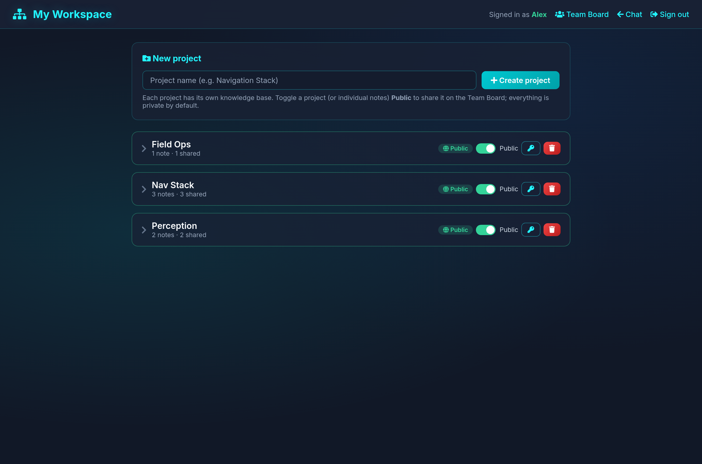
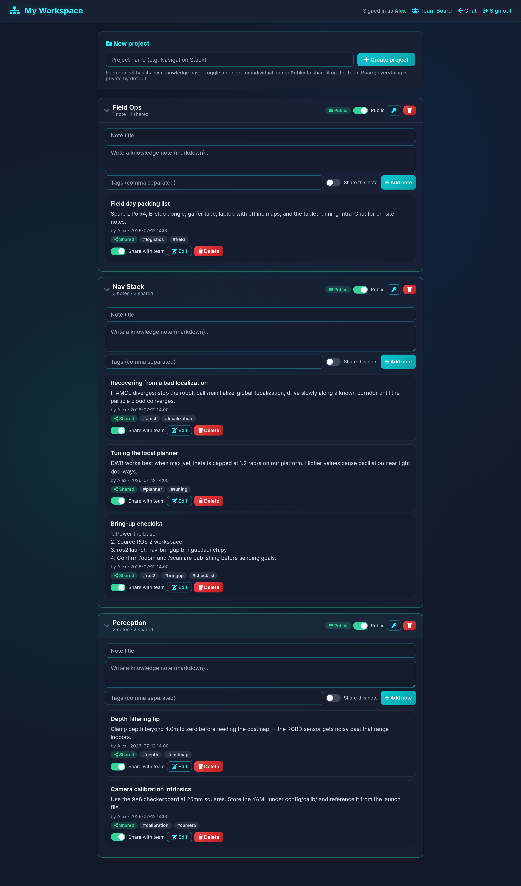
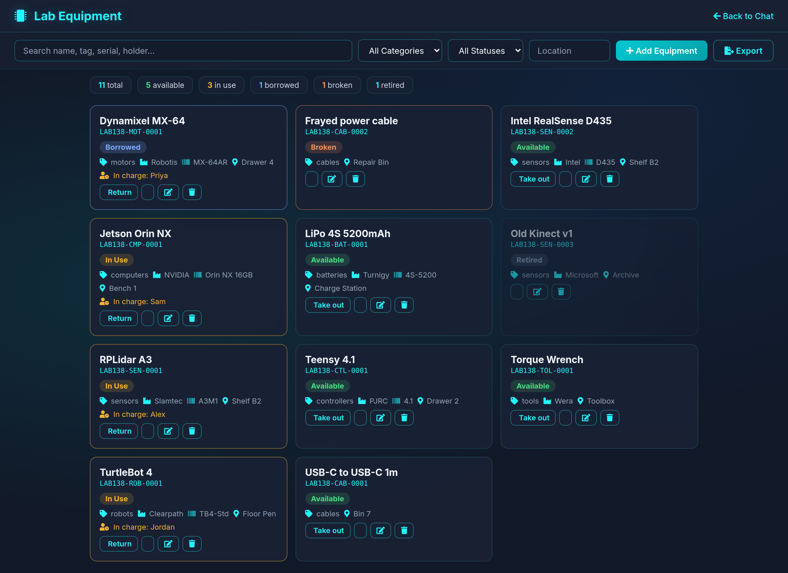
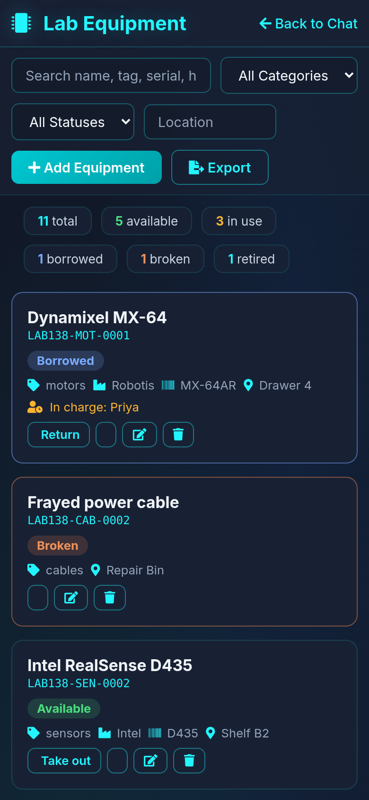
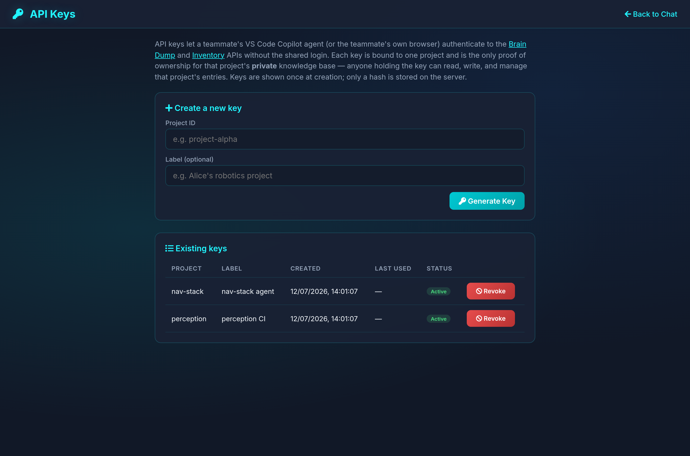

<div align="center">

# 💬 Intra-Chat

### The offline-first team hub for labs, workshops, and robotics crews.

**Chat, knowledge, files, and gear — all on your own LAN. No cloud, no
accounts, no subscriptions. One Python process, any browser.**

[](LICENSE)
[](https://www.python.org/downloads/)
[](https://flask.palletsprojects.com/)
[](https://socket.io/)
[](#)
[](CONTRIBUTING.md)

<sub>No accounts. No cloud. No tracking. Your data never leaves the building.</sub>

<br/>


</div>

---

## The problem

Slack and Discord are built for the cloud. For a **lab bench, a workshop, or a
field robot on a private network**, that model is backwards:

- Your notes, IP, and calibration data live on someone else's servers.
- The free tier eats your message history right when you need it.
- Half your machines have no internet — but they're all on the same LAN.
- "Where's the lidar?" and "what was that launch command?" get lost in the scroll.

## The answer

**Intra-Chat is a single self-hosted app your whole team reaches over a browser.**
It bundles the handful of tools a hands-on team actually needs into one place:
real-time chat, a searchable command manual, per-project knowledge bases, file
sharing, a lab-equipment inventory, and an agent API — with an optional
**local** LLM for summaries. Nothing leaves your network.

```bash
git clone https://github.com/tvpian/Intra-Chat.git && cd Intra-Chat
python -m pip install -r requirements.txt
python setup_password.py && python app.py     # → http://localhost:5656
```

That's the entire install. Point every phone and laptop on the LAN at the URL
and you're running.

## Why teams pick it

- 🔒 **Truly local-first.** One process on your LAN. No SaaS bill, no third
  party, no telemetry. Works with the internet unplugged.
- 🪶 **Radically simple.** One `app.py`, one template per feature, plain JSON
  on disk. Easy to read, fork, back up, and trust. The whole thing fits in
  your head.
- 🧠 **It remembers.** Pin commands to a searchable manual, file long-form
  notes into per-project knowledge bases — the durable memory the chat scroll
  never gives you.
- 🔧 **Built for the bench.** A real asset inventory with printable labels,
  owners, and check-out history — because "who has the lidar?" deserves a
  better answer than scrolling.
- 🤖 **Agent-ready.** Scoped API keys let coding agents and scripts push
  knowledge straight into a project. Optional on-box Ollama summaries keep AI
  local too.
- 📱 **Everywhere on the LAN.** Fully responsive — the tablet zip-tied to the
  robot and the desktop in the office get the same UI.

## Who it's for

Robotics teams, hardware labs, makerspaces, research groups, home labs,
air-gapped or privacy-sensitive environments — anyone who shares a network and
wants their conversations, know-how, and equipment in one place they control.

## Features at a glance

|   | Feature | What it does |
|---|---------|--------------|
| 💬 | **Real-time chat** | Socket.IO-powered, persistent across reloads, with sane message-history retention. |
| 📁 | **Smart file uploads** | Drag-and-drop with auto-categorisation across 14 buckets (code, images, robotics, configs, models, …). |
| 📒 | **Tech manual** | Press `Ctrl+E` on any chat message to pin it into a searchable reference book, tagged by category. |
| 🧠 | **Brain-dump board** | Long-form, taggable, reaction-able knowledge entries. Public to the team by default; export as Markdown. |
| 🗂️ | **Personal workspaces** | Per-member sign-in with a personal passcode. Group notes into **projects**, keep them private or share them — flip a whole project public in one click. |
| 📚 | **Project knowledge base** | Searchable, tagged knowledge grouped by project: the durable memory behind the chat noise. |
| 📦 | **Lab equipment inventory** | Assets with **printable, meaningful tags** (`LAB138-SEN-0003` = lab no · category · procurement order), an **In-charge** owner from your roster, six statuses, check-out/check-in history, and CSV/Markdown export. |
| 🤖 | **Agent / API integration** | Scoped **API keys** so agents and scripts push knowledge programmatically. See [docs/AGENT_INTEGRATION.md](docs/AGENT_INTEGRATION.md). |
| 🔔 | **Live notifications** | Toast + bell badge + browser push on every new brain-dump or system event. |
| 🚨 | **Broadcast alerts** | `/alert your message` plays a sound for every connected client — perfect for "build's broken". |
| 📄 | **Team docs** | Point `TEAM_DOCS_PATH` at a folder of `.md` files; they surface at `/docs` and inside manual search. |
| 🦙 | **Local AI summaries** | `/summarize` calls a model on **your** machine via [Ollama](https://ollama.com). No API keys, no data egress. |
| 🔐 | **Layered auth** | Shared login password + per-member passcodes + IP allow-listing + brute-force lockout. |
| ⌨️ | **Power-user UX** | Slash-commands, `Ctrl+H/M/U/E/B/L` shortcuts, copy-with-username-stripped, message export. |
| 📱 | **Fully responsive** | Every page — chat, workspace, inventory, knowledge, manual, API keys — adapts to phones and small screens. |

## Screenshots

<table align="center">
<tr>
<td align="center" width="50%"><b>Login</b><br/></td>
<td align="center" width="50%"><b>Chat</b><br/></td>
</tr>
<tr>
<td align="center" width="50%"><b>History</b><br/></td>
<td align="center" width="50%"><b>Tech Manual</b><br/></td>
</tr>
<tr>
<td align="center" width="50%"><b>Brain Dump</b><br/></td>
<td align="center" width="50%"><b>Notifications</b><br/></td>
</tr>
</table>

### Workspaces & project knowledge base

Every member gets a personal workspace. Organise notes into **projects**,
keep them private or flip a whole project **Public** to share it on the team
board. Each project is its own searchable, taggable knowledge base.

<table align="center">
<tr>
<td align="center" width="50%"><b>My Workspace</b><br/></td>
<td align="center" width="50%"><b>Knowledge base</b><br/></td>
</tr>
</table>

### Lab equipment inventory

Track assets with **printable, meaningful tags** (`LAB138-SEN-0003` = lab no ·
category · procurement order), an **In-charge** owner picked from your team
roster, and a full status set (Available / In Use / Borrowed / Lost / Retired
/ Broken). Check-out / check-in with history and CSV/Markdown export.

<table align="center">
<tr>
<td align="center" width="60%"><b>Inventory</b><br/></td>
<td align="center" width="40%"><b>On a phone</b><br/></td>
</tr>
</table>

### Agent / API integration

Mint scoped **API keys** so coding agents and scripts can push knowledge into
a project programmatically — no browser required.

<p align="center"></p>

> Want to record a GIF for your own fork? Drop it in `docs/screenshots/` and
> reference it here.

## Quick start

**Requirements:** Python 3.8+ and a browser. That's it.

```bash
git clone https://github.com/tvpian/Intra-Chat.git
cd Intra-Chat

python -m pip install -r requirements.txt
python setup_password.py        # interactive — writes .env
python app.py                   # http://localhost:5656
```

Open the URL in any browser on your LAN, type the password you just chose, and
you're in. To let teammates join, share your machine's LAN address (e.g.
`http://192.168.1.42:5656`) — the server listens on `0.0.0.0` by default.

> **Heads up:** `setup_password.py` sets `chmod 600` on the resulting `.env`.
> It holds your login password and a Flask session-signing key — never commit
> it. Runtime data (chat, notes, inventory, keys) stays in local JSON files
> that are already git-ignored.

## Configuration

All configuration lives in `.env`. Copy [.env.example](.env.example) and edit
the values you care about. The most useful options:

| Variable          | Default                  | Purpose                                                |
| ----------------- | ------------------------ | ------------------------------------------------------ |
| `APP_PASSWORD`    | _(required)_             | Shared login password                                  |
| `SECRET_KEY`      | random per launch        | Flask session signing key                              |
| `HOST` / `PORT`   | `0.0.0.0` / `5656`       | Bind address                                           |
| `UPLOAD_FOLDER`   | `<repo>/uploads`         | Where uploaded files are stored                        |
| `TEAM_DOCS_PATH`  | _(unset)_                | Optional folder of `.md` files exposed in `/docs`      |
| `OLLAMA_HOST`     | `http://localhost:11434` | Local Ollama server URL                                |
| `OLLAMA_MODEL`    | `llama3.2`               | Model used by `/summarize`                             |
| `MAX_ATTEMPTS`    | `5`                      | Failed login lockout threshold                         |
| `LOCK_MS`         | `30000`                  | Lockout duration in milliseconds                       |
| `LAB_NO`          | `138`                    | Lab number embedded in printable inventory asset tags  |
| `TEAM_ROSTER`     | _(unset)_                | Comma-separated extra names for the inventory In-charge picker |
| `DEBUG_LOGS`      | `0`                      | Set `1` to write upload/auth debug logs to disk        |

## Optional: local AI with Ollama

The `/summarize` chat command calls a model on **your machine** through
Ollama. If Ollama isn't running, the command degrades gracefully with an
explanatory message — the rest of the app keeps working.

```bash
# install once: https://ollama.com
curl -fsSL https://ollama.com/install.sh | sh
ollama pull llama3.2          # or mistral, qwen2.5, gemma3, …
ollama serve
```

Switch the model at any time by setting `OLLAMA_MODEL` in `.env`.

## Agent & API integration

Beyond the browser UI, Intra-Chat exposes a small HTTP API so coding agents
and scripts can push knowledge into a project automatically. Mint a scoped
key at `/admin/api-keys` (or `POST /api/keys`), then authenticate with
`Authorization: Bearer <key>`.

```bash
export INTRA_CHAT_URL="http://localhost:5656"
export INTRA_CHAT_KEY="ic_<project>_xxxxxxxxxxxxxxxxxxxxxxxxxxxxxxxx"
export INTRA_CHAT_PROJECT="<project>"

python3 scripts/kb_push.py --title "Deploy steps" --file NOTES.md
```

Keys are shown once and stored only as a hash. Full details, endpoints, and
examples live in [docs/AGENT_INTEGRATION.md](docs/AGENT_INTEGRATION.md).

## Slash commands & shortcuts

Inside the chat box:

| Command           | Effect                                                      |
| ----------------- | ----------------------------------------------------------- |
| `/search <term>`  | Jump straight to the tech manual filtered by `<term>`.      |
| `/docs <term>`    | Open the team-docs browser, filtered.                       |
| `/alert <msg>`    | Broadcast a sound + modal alert to everyone.                |
| `/summarize`      | Send the last ~10 messages to the local LLM for a summary.  |

Keyboard shortcuts (anywhere on the chat page):

| Keys      | Action                              |
| --------- | ----------------------------------- |
| `Enter`   | Send (Shift+Enter for newline)      |
| `Ctrl+H`  | History                             |
| `Ctrl+M`  | Tech manual                         |
| `Ctrl+B`  | Brain dump board                    |
| `Ctrl+U`  | Change username                     |
| `Ctrl+E`  | Export the last message to manual   |
| `Ctrl+L`  | Logout                              |
| `↑`/`↓`   | Scroll messages                     |

## Architecture

```
                     ┌─────────────────────────────────────┐
                     │            Browser (LAN)            │
                     │   chat · workspace · inventory ·    │
                     │   knowledge · manual · API keys     │
                     └───────────────│─────────────────────┘
                                     │  WebSocket + HTTP + REST
                     ┌───────────────▼─────────────────────┐
                     │      app.py — Flask + Socket.IO     │
                     │  ┌────────┐ ┌────────┐ ┌─────────┐  │
                     │  │  auth  │ │ uploads│ │ summary │──┼──► Ollama
                     │  │ + keys │ │        │ │         │  │    (local)
                     │  └────────┘ └────────┘ └─────────┘  │
                     │  ┌────────┐ ┌────────┐ ┌─────────┐  │
                     │  │ manual │ │ brain/ │ │inventory│  │
                     │  │ + docs │ │  KB    │ │ + notif │  │
                     │  └────────┘ └────────┘ └─────────┘  │
                     └────────────────┬────────────────────┘
                                      │
                              ┌───────▼────────┐
                              │   JSON files   │
                              │ chat · manual ·│
                              │ braindump ·    │
                              │ projects ·     │
                              │ members ·      │
                              │ inventory ·    │
                              │ api_keys       │
                              └────────────────┘
```

Storage is intentionally JSON-on-disk — easy to inspect, back up, `grep`, and
migrate. Writes are atomic (temp file + rename + `.bak`). A future SQLite
backend would be a welcome contribution.

## Deployment

For a long-running LAN deployment, use the included systemd template:

```bash
sudo cp intra_chat.service.template /etc/systemd/system/intra_chat.service
sudo $EDITOR /etc/systemd/system/intra_chat.service     # set User + paths

sudo systemctl daemon-reload
sudo systemctl enable --now intra_chat
sudo journalctl -u intra_chat -f
```

Full deployment notes (reverse proxy, security checklist, etc.) live in
[DEPLOYMENT.md](DEPLOYMENT.md).

## Project layout

```
Intra-Chat/
├── app.py                      # Flask + Socket.IO entrypoint, all routes
├── ai_engine.py                # Ollama wrapper for /summarize
├── setup_password.py           # Interactive .env generator
├── requirements.txt
├── .env.example                # Documented env-var template
├── intra_chat.service.template # systemd unit template
├── templates/
│   ├── index.html              # Main chat UI
│   ├── login.html
│   ├── history.html
│   ├── manual.html
│   ├── docs.html
│   ├── braindump.html
│   ├── workspace.html          # Personal workspaces & projects
│   ├── knowledge.html          # Project knowledge base
│   ├── inventory.html          # Lab equipment inventory
│   └── api_keys.html           # Agent API-key management
├── scripts/
│   ├── kb_push.py              # Push knowledge via the API
│   └── kb_demo.sh              # End-to-end API demo
├── docs/
│   ├── AGENT_INTEGRATION.md    # Agent/API guide
│   └── screenshots/            # README assets
├── static/                     # alert.mp3, fonts, etc.
└── uploads/                    # File storage (auto-categorised)
```

## Contributing

Issues and PRs are welcome. See [CONTRIBUTING.md](CONTRIBUTING.md) for ground
rules — short version: keep it small, keep it local, no heavy deps.

Areas where help is especially welcome:

- 🗄️ Optional SQLite backend (currently JSON files)
- 🔌 More AI backends (`OpenAI`, `llama.cpp`, …) behind `ai_engine.py`
- 🎨 Theming / light mode
- 🌐 i18n for the UI strings
- ✅ Tests

## License

[MIT](LICENSE) © 2026 [tvpian](https://github.com/tvpian)

Free to use, fork, and self-host. If Intra-Chat is useful to your team, a
⭐ on the repo helps others find it.

---

<div align="center">
<sub>Built with Flask, Socket.IO, and a healthy distrust of the cloud.</sub>
</div>
